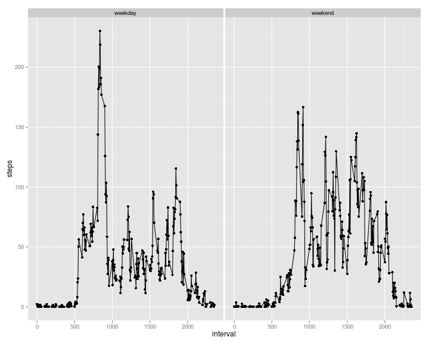

Current timestamp: Sun Jan 18 18:07:17 2015 

## Loading and preprocessing the data


```r
library(data.table)
library(lubridate)

activities <- as.data.table(read.csv("./activity.csv"))
activities$date <- ymd(activities$date)
```

## What is mean total number of steps taken per day?

```r
library(plyr)
stats <- ddply(activities, ~date,summarise,total_steps_per_day = sum(steps,na.rm=TRUE),
               mean=mean(steps, na.rm = TRUE),
               median=median(steps, na.rm = TRUE))
```
###  1. Make a histogram of the total number of steps taken each day

```r
hist(stats$total_steps_per_day, breaks = 15, bg="white")
```

 
### 2. Calculate and report the mean and median total number of steps taken per day

#### Mean number of steps taken per day: 9354.2295082

#### Median number of steps taken per day: 10395

## What is the average daily activity pattern?

### 1. Make a time series plot of the 5-minute interval (x-axis) and the average number of steps taken, across all days (y-axis)

```r
average_daily <- as.data.table(aggregate(steps ~ interval, activities, "mean"))
plot(average_daily, type = "l", bg="white")
```

 
### 2. Which 5-minute interval, on average across all the days in the dataset, contains the maximum number of steps?

#### Interval 835 contains 206.1698113 steps on average

## Imputing missing values

### 1. Calculate and report the total number of missing values in the dataset (i.e. the total number of rows with NAs)
####  Number of rows with missing values: 2304
### 2. For missing values, use the mean value for that interval, which we calculated for the average daily activity pattern.
### 3. Create new dataset new_activities; fill in missing step values.


```r
setkey(average_daily, interval)

new_activities <- activities
setkey(new_activities, date, interval)
cases <- new_activities[!complete.cases(activities)]

for (i in 1:nrow(cases)) {              # Should be possible to vectorize for-loop,  since none of the results depend on each other, but this works.
    row <- cases[i]
    steps <- as.integer(average_daily[.(row$interval)]$steps + .5) # round to nearest integer
    new_activities[.(row$date, row$interval)]$steps <-  steps
 }
```
### 4. Make a histogram of the total number of steps taken each day


```r
total_daily <- as.data.table(aggregate(steps ~ date, new_activities, "sum"))
hist(total_daily$steps, breaks = 15)
```

 
#### 4a. Calculate and report the mean and median total number of steps taken per day.
#### Mean total steps per day:  1.0765639 &times; 10<sup>4</sup>
#### Median total steps per day: 10762

## Are there differences in activity patterns between weekdays and weekends?
### 1. Create a new factor variable in the dataset with two levels – “weekday” and “weekend” indicating whether a given date is a weekday or weekend day.

```r
new_activities$day_of_week <- factor(as.integer(wday(new_activities$date) %in% list(1,7)),
                                     levels = c(0,1), labels=c("weekday", "weekend"))
```
### Make a panel plot containing a time series plot (i.e. type = "l") of
### * the 5-minute interval (x-axis)
### * and the average number of steps taken, averaged across all weekday days or weekend days (y-axis).


```r
library(ggplot2)
qplot(interval, steps, data = aggregate(steps ~ interval + day_of_week, new_activities, "mean"), facets = ~day_of_week) + geom_line()
```

 


